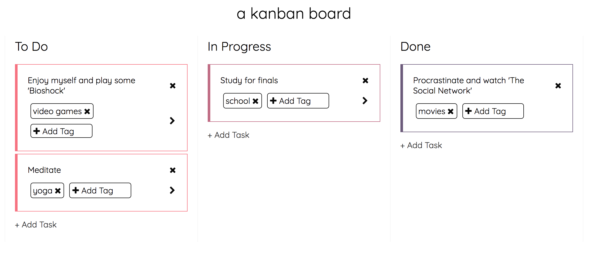

# Assignment 2 - Kanban Board

In this second assignment, you will write an API for a
[`Kanban Board`](https://leankit.com/learn/kanban/kanban-board/) to be used by
a single person to manage tasks they have yet `todo`, tasks that are `in
progress`, and tasks that are `done`.  This application has a front-end web
app that will be useful as both a debugging tool, as well as a visualization
of how your API contributes to a successful product that a user can interact



## Learning Objectives

This assignment, unlike the first assignment, involves the complete application-
layer backend development experience.  The skills honed in this project are those
you'd use day-to-day when developing any backend supporting an app, be it web
or mobile.  As a result, it involves several tools / technologies / concepts:

* `Python` as a language and `Flask` as a framework
* [`JSON`](http://www.json.org/) as a means of sending and receiving data
* `HTTP` requests / responses
* `MySQL` system configuration and usage
* `SQL-esque` data-modeling
* [`ORM`](http://flask-sqlalchemy.pocoo.org/2.1/) usage and data-modeling
* `SQL` querying
* Object serialization
* Writing an `API` to fit a specification given by front-end

## Table of Contents

* [Academic Integrity and Collaboration](#academic-integrity-and-collaboration)
* [System Configuration](#system-configuration)
* [Database Creation](#database-creation)
* [Organization](#organization)
* [Front-end](#front-end)
* [Expected Functionality](#expected-functionality)
* [Suggestions](#suggestions)
* [Testing Your Code](#testing-your-code)
* [Extensions](#extensions)
* [Project Submission](#project-submission)
* [Grading](#grading)

## Academic Integrity and Collaboration

#### Academic Integrity

Note that these projects should be completed **individually**. As a result, all University-standard AI guidelines should be followed.

#### Code Attribution and Collaboration

One of the reasons we chose `Flask` as an initial backend framework for students to use is because of its phenomenal support online. Looking up framework documentation and adapting the docs' sample code to suite your own needs in something we expect and want you to do, as it allows you to explore and increase your self-sufficiency regarding backend development. However, if you find code in a `StackOverflow` post or in an open source Github repository, then you should cite it accordingly. See the [project submission](#project-submission) section for guidelines as to where to include those citations.

## System Configuration

The initial [**4** steps](https://github.com/Cornell-PoBE/A1/blob/master/README.md#system-configuration)
from `A1` are required in order to interact with this project.  

In addition to the above steps, we expect you to have `MySQL` installed.  
A guide to do so can be found [here](https://dev.mysql.com/doc/mysql-getting-started/en/#mysql-getting-started-installing).  
In addition, you should be able to access your `MySQL` system's terminal via the command-line
easily.  We recommend setting up your `$PATH` in order for you to access the `mysql` console.
To do so, add the following line to your `.bashrc`, `.zshrc`, or whatever other shell you
might use (these configuration files are found at your `root user directory: ~`):

````bash
export PATH="/path/to/my/mysql/bin_folder/bin:$PATH"
````
As an example, I'm on a `Mac` and my `MySQL` bin is located at the following path:

````bash
/usr/local/mysql-5.7.17-macos10.12-x86_64/bin
````

In addition, we we expect your backend to parameterized with [`environment variables`](https://en.wikipedia.org/wiki/Environment_variable) so that we can run the
code on our systems with these variables set to our own environment's configurations.  In
order to make dealing with environment variables easier, we recommend you install
[`autoenv`](https://github.com/kennethreitz/autoenv).  `autoenv` allows for environment
variable loading on `cd-ing` into the base directory of the project.  You can declare
environment variables in a `.env` file of the following format:

````bash
export APP_SETTINGS=config.DevelopmentConfig
export DB_NAME=pobe_a2_db
...
````

On `cd-ing` into your project directory, you can ensure that these variables are, in fact,
loaded into your environment by running the following argument, with `VARIABLE_NAME` replaced
with a variable you're setting in your `.env` file:

````bash
echo $VARIABLE_NAME
````

## Database Creation

`MySQL` will give you an initial, temporary password that you use to sign into the
console for the first time:

````bash
mysql -u root -p <temporary-password>
````
Once in you can create a user account outside of `root` that you use to manage all your
local databases:

````bash
CREATE USER 'newuser'@'localhost' IDENTIFIED BY 'password';
````

You can provide that user account full access via the following commands:

````bash
GRANT ALL PRIVILEGES ON * . * TO 'newuser'@'localhost';
FLUSH PRIVILEGES;
````

Once you have this user setup, quit the console and reenter with this user:

````bash
quit
mysql -u newuser -p password
````

Create a database with this user via the following command:

````bash
CREATE DATABASE pobe_a2_db;
````

You have successfully created a `MySQL` user account and database!

## Organization

The following describes the initial file-structure of the directory `./src`:

````bash
.
├── app
│   ├── __init__.py
│   ├── base.py
│   ├── constants.py
│   ├── static
│   │   ├── css
│   │   │   └── styles.css
│   │   └── js
│   │       └── bundle.js
│   └── templates
│       ├── 404.html
│       └── index.html
├── config.py
├── manage.py
├── requirements.txt
└── run.py
````

Below consists of brief discussions of each one of the above files:

#### config.py

This file defines configurations for the `Flask` app to run with.  These configurations
specify things like the number of threads the app runs with, whether `DEBUG` mode is on,
etc.  In addition, this file grabs environment variables in order to establish the `DB_URL`,
a.k.a. the `URL` your application uses to interact with the database.  On looking at this file,
you'll see it accesses the following environment variables: `DB_USERNAME`, `DB_PASSWORD`,
`DB_HOST`, and `DB_NAME`.  These correspond to your user account name and password that you
used to create the database in the [`Database Creation`](#database-creation) section,
the `IP` you're running the database on (should be `localhost` if you're developing locally
for this project, which you should be), and the name of the database, "pobe_a2_db", or whatever
you chose to name your database.  

This file articulates the main environment variables you MUST have in order to run the app
in the first place: all the database-related variables, plus a variable specifying
which configuration you're running the app in.  We recommend you run the app the
`DevelopmentConfig` when you work on it, so you can see debugging information and such.  As
a result, your `.env` file should look like the following, at the minimum:

````bash
export APP_SETTINGS=config.DevelopmentConfig
export DB_USERNAME=your_username
export DB_PASSWORD=your_password
export DB_HOST=localhost
export DB_NAME=pobe_a2_db
````

#### manage.py

This file provides you with a command-line interface for performing changes to your
database as your application evolves.  We expect you to leverage
[`flask-sqlalchemy`](http://flask-sqlalchemy.pocoo.org/2.1/)
during this project, meaning you'll be able to describe your database tables as `Python
classes`.  As you define your `classes`, your actual database should reflect the schema
you design.  To ensure this happens, you can run "migrations" to change the database.  
Each migration stores metadata in a `./src/migrations` directory.  The below commands
enumerate the workflow of the migrating the database using `manage.py`:

````bash
# Initialize migrations - only needs to be done initially
python manage.py db init
# Create a migration
python manage.py db migrate
# Apply it to the DB
python manage.py db upgrade
````

#### requirements.txt

This file outlines the initial module dependencies of the app. To install
these, run `pip install -r requirements.txt`. If you pip install a module
during the duration of your project, be sure to `pip freeze > requirements.txt`
to add the new module to the requirements.txt file, **or else we won't be
able to run your project.**

#### run.py

This file is the script used to run your `Flask` app.  You can run your app
via the following:

````bash
python run.py
````

#### app/static

This directory contains the front-end `JavaScript` / `CSS`.  You do not need
to touch this directory or its contents.

#### app/templates

This directory contains the front-end `HTML`.  You do not need to touch this
directory or its contents.

#### app/__init__.py

This file bootstraps the app / database.  The only part of this file you should
be concerned with is the commented-out code in the middle of the file:

````python
# Import + Register Blueprints
# Workflow is as follows:
# from app.blue import blue as blue
# app.register_blueprint(blue)
````

What does this mean?  We encourage you to define your app functionality in a
[`Flask Blueprint`](http://flask.pocoo.org/docs/0.12/blueprints/).  Once you
write that blueprint, you can import it and register it with the `Flask` application
instance using the above, commented-out code.  

#### app/constants.py

This is an empty file where you can keep app-wide constants.

#### app/base.py

This file defines an abstract `SQLAlchemy` model.  We expect all your `SQLAlchemy`
models to extend this base, abstract class.  

## Front-end

[`Here`](http://34.215.197.79/boards) is a link to a publicly-available instance of the entire application, so you can
explore its capabilities and how your backend system should look with a hook-up front end. 

## Expected Functionality

#### Create a Board
*Request:* `POST /kanban/boards?title={board_title}`

*Response:*
````javascript
{
  "success": true,
  "data": {
    "board": {
      "board_elements": [],
      "created_at": "2017-05-15T22:43:32+00:00",
      "id": 1,
      "title": "My Awesome Board",
      "updated_at": "2017-05-15T22:43:32+00:00"
    }
  }
}
````

#### Delete a Board
*Request:* `DELETE /kanban/boards?id={board_id}`

*Response:*
````javascript
{
  "success": true
}
````

#### Get Boards
*Request:* `GET /kanban/boards`

*Response:*
````javascript
{
  "success": true,
  "data": {
    "boards": [
      {
        "created_at": "2017-05-15T22:43:32+00:00",
        "id": 1,
        "title": "My Awesome Board",
        "updated_at": "2017-05-15T22:43:32+00:00",
        "todo_count": 1,
        "inprogress_count": 3,
        "done_count": 5
      },
      // More boards ..
    ]
  }
}
````

#### Get Board By ID
*Request:* `GET /kanban/boards/{board_id}`

*Response:*
````javascript
{
  "success": true,
  "data": {
    "board": {
      "id": 1,
      "title": "My Awesome Board",
      "created_at": "2017-05-15T22:43:32+00:00",
      "updated_at": "2017-05-15T22:43:32+00:00",
      "todo": [
        // todo board_elements, see structure below
      ],
      "inprogress": [
        // inprogress board_elements, see structure below
      ],
      "done": [
        // done board_elements, see structure below
      ]
    }
  }
}
````

#### Create a Board Element
*Request:* `POST /kanban/board_elements?board_id={board_id}&description={description}&category={todo|inprogress|done}`

*Response:*
````javascript
{
  "success": true,
  "data": {
    "board_element": {
      "id": 1,
      "board_id": 2,
      "category": "todo",
      "created_at": "2017-05-15T22:43:32+00:00",
      "updated_at": "2017-05-15T22:43:32+00:00",
      "description": "A Todo Task, I should get this done!",
      "tags": [
        // optional part of the assignment, but an empty array should be returned regardless
      ]
    }
  }
}
````

#### Delete a Board Element
*Request:* `DELETE /kanban/board_elements?id={board_element_id}`

*Response:*
````javascript
{
  "success": true
}
````

#### Advance a Board Element
A.k.a. make a `todo` board element an `inprogress` board element, or an `inprogress`
board element a `done` board element.

*Request:* `POST /kanban/board_elements/advance?id={board_element_id}`

*Response:*
````javascript
{
  "success": true
}
````

## Suggestions

As stated, we require you to use `Flask`, `MySQL`, and `SQLAlchemy`.  Specifically,
we recommend you use [`Flask-SQLalchemy`](http://flask-sqlalchemy.pocoo.org/2.1/),
as it is the easiest module to use with `Flask` itself.

Additionally, we recommend you use [`Marshmallow-SQLalchemy`](http://marshmallow-sqlalchemy.readthedocs.io/en/latest/)
for object serialization (serializing a `SQLAlchemy` model to JSON).

As far as querying goes, `SQLAlchemy`'s [`query`](http://flask-sqlalchemy.pocoo.org/2.1/queries/)
and filtering options provide reasonably solid support for the type of querying
you'll be doing with this app, but we also recommend exploring querying data via
raw `MySQL` queries, as it is the most optimal approach to aggregating the data
for some of the endpoints you're required to implement.

Any good API establishes constraints on the resources it involves
(such as uniqueness of certain fields, ensuring non-empty Kanban board titles, etc.)  Any constraints you establish via SQL or your application logic should be documented
in your submission `readme.txt` (see the [Project Submission](#project-submission) section).
Such attention to detail will definitely impress us / make your project stand out.

## Testing Your Code

We recommend testing your code using [`Flask Testing`](http://flask.pocoo.org/docs/0.12/testing/), or `cURL-ing` / `httpie-ing` from the command line.  You can also hand-test via the front-end.

To make your lives easier we have provided you our test cases in the test.py file that you may leverage to test your endpoints. This file uses the unittest module extensively and can be extended if you wish to further develop your test suite to handle your own edge cases.

## Extensions

### 1. Tags
As you might notice, the front-end features an "+ Add Tag" button on every board element.  
A tag can belong to several different board elements, and a board element can have many tags.
If you wish to make the tags portion of your Kanban board work, you can fulfill the below
spec and then run several POST requests to the following URL to fill your database with
tags to be added to board elements (I use `httpie` in my examples):

````bash
http post localhost:5000/kanban/tags?name=exercise
http post localhost:5000/kanban/tags?name=school
http post localhost:5000/kanban/tags?name=video+games
....
````
The spec is as follows:

#### Create a Tag
*Request:* `POST /kanban/tags?name={name}`

*Response:*
````javascript
{
  "success": true,
  "data": {
    "tag": {
      "board_elements": [],
      "created_at": "2017-05-15T22:50:28+00:00",
      "id": 4,
      "name": "exercise",
      "updated_at": "2017-05-15T22:50:28+00:00"
    }
  }
}
````

#### Get All Tags
*Request:* `GET /kanban/tags`

*Response:*
````javascript
{
  "success": true,
  "data": {
    "tags": [
      {
        "board_elements": [],
        "created_at": "2017-05-15T22:50:28+00:00",
        "id": 1,
        "name": "exercise",
        "updated_at": "2017-05-15T22:50:28+00:00"
      },
      {
        "board_elements": [
          4, 5 // just indexes of the board elements that have this tag associated with them
        ],
        "created_at": "2017-05-15T22:50:28+00:00",
        "id": 2,
        "name": "exercise",
        "updated_at": "2017-05-15T22:50:28+00:00"
      }
    ]
  }
}
````

#### Add Tag to Board Element
*Request:* `POST /kanban/tags/add?tag_id={tag_id}&board_element_id={board_element_id}`

*Response:*
````javascript
{
  "success": true
}
````

#### Remove Tag from Board Element
*Request:* `DELETE /kanban/tags/add?tag_id={tag_id}&board_element_id={board_element_id}`

*Response:*
````javascript
{
  "success": true
}
````

### 2. MySQL Efficiency

You should aim to make your schema (models' setup / relationships) and queries as efficient
as possible, always shifting constraint-checking and data-aggregation tasks to the database /
your queries.  Part of our overview of your project will be reading your code, and a clean
schema and solid querying will keep your code neat and tidy.  

## Project Submission

You should submit your project along with a `readme.txt` for your citations, project setup information, and any extensions you might have done. This should be at the root of your project (inside the src directory). Run the following to zip your project:

````bash
zip -r src.zip src -x src/venv\*
````

You can then submit this file to `CMS`.

## Grading
You will be graded based on how many test cases you pass. Our test cases are provided for you in the test.py file.
